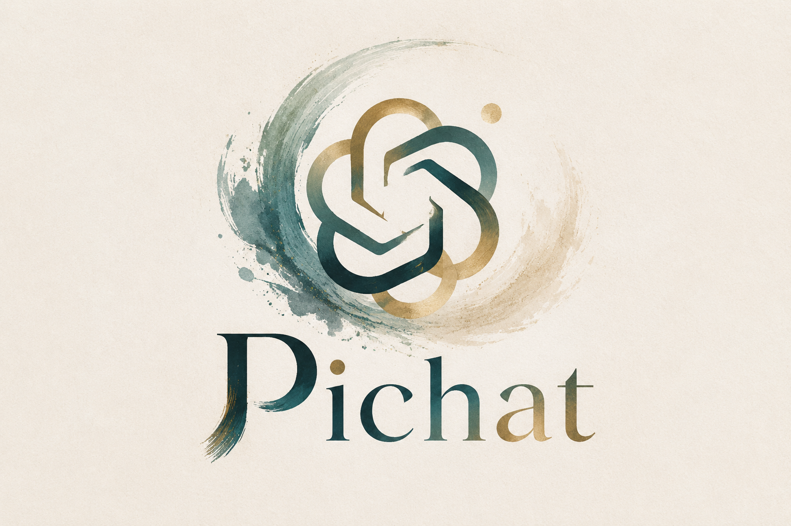

<div align="center">
  
  <h1>Pichat</h1>
  <p><strong>纯前端 AI 对话生图</strong></p>
  <p>连接任意 OpenAI 兼容 API，用自然语言创作图片</p>
  <br>
  
  
  
  
  <br><br>
</div>

---

## 功能一览

<div align="center">
<table>
<tr>
<td align="center" width="50%">
<strong>对话生图</strong><br>
描述画面，即时生成
</td>
<td align="center" width="50%">
<strong>图片编辑</strong><br>
附加参考图引导修改
</td>
</tr>
<tr>
<td align="center">
<strong>瀑布流模式</strong><br>
批量并发，滚动自动加载
</td>
<td align="center">
<strong>灵活尺寸</strong><br>
Auto / 1:1 / 3:2 / 16:9 / 2K / 4K / 自定义
</td>
</tr>
<tr>
<td align="center">
<strong>重试与变体</strong><br>
多次生成，分支切换 `< 1/N >`
</td>
<td align="center">
<strong>画廊与历史</strong><br>
浏览所有图片，回顾过往对话
</td>
</tr>
<tr>
<td align="center">
<strong>全屏灯箱</strong><br>
原始分辨率查看，一键下载
</td>
<td align="center">
<strong>Thinking 模式</strong><br>
low / medium / high / xhigh 推理强度
</td>
</tr>
<tr>
<td align="center" colspan="2">
<strong>零后端</strong> — 完全运行在浏览器，数据存储于 IndexedDB
</td>
</tr>
</table>
</div>

---

## 快速开始

```bash
npm install
npm run dev
```

打开浏览器，访问终端输出的地址，在 **设置** 页填入 API Base URL 和 API Key 即可使用。

**生产构建：**

```bash
npm run build     # 类型检查 + 打包
npm run preview   # 预览构建产物
```

---

## 技术栈

| 层级 | 技术 |
|------|------|
| UI | React 19 + TypeScript 6 |
| 构建 | Vite 8 |
| 状态 | Zustand |
| 路由 | react-router-dom (HashRouter) |
| 渲染 | react-markdown + KaTeX |
| 存储 | IndexedDB (图片 Blob + 自动缩略图) |

---

## API 兼容性

调用 [OpenAI Responses API](https://platform.openai.com/docs/api-reference/responses) 的 `image_generation` 工具，支持 SSE 流式输出。任何兼容该接口的端点均可使用。

| 模型 | 尺寸支持 |
|------|---------|
| gpt-4o / gpt-4.1 | 标准尺寸（最大 1792×1024） |
| gpt-5.4 | 标准 + 2K / 4K（最大 3840×2160） |

> 设置中的 Model 字段是聊天模型（如 `gpt-5.4`），底层图片模型由 API 自动选择。

---

## 项目结构

```
src/
├── main.tsx                  # 入口
├── App.tsx                   # 路由与全局 Provider
├── types.ts                  # 共享类型定义
├── lib/
│   ├── api.ts                # Responses API 客户端（流式 + 重试）
│   ├── store.ts              # Zustand store + IndexedDB 持久化
│   ├── imageStore.ts         # 图片 Blob 存储 / 缩略图 / 压缩
│   ├── theme.ts              # 明暗主题切换（圆形动画）
│   ├── markdown.tsx          # Markdown + 数学公式渲染
│   └── filename.ts           # 下载文件名生成
├── pages/
│   ├── Landing.tsx           # 首页
│   ├── Chat.tsx              # 对话生图
│   ├── Waterfall.tsx         # 瀑布流批量生成
│   ├── Gallery.tsx           # 图片画廊
│   ├── History.tsx           # 对话历史
│   └── Settings.tsx          # 设置
├── components/
│   ├── Header.tsx            # 顶部导航
│   ├── InputBar.tsx          # 输入栏（尺寸 / Thinking / 图片附件）
│   ├── ImageCard.tsx         # 图片卡片
│   ├── Lightbox.tsx          # 全屏灯箱
│   ├── Toast.tsx             # 通知提示
│   └── WarningPopup.tsx      # 确认弹窗
└── styles/
    └── globals.css           # 设计变量与全局样式
```

---

## 许可证

MIT
